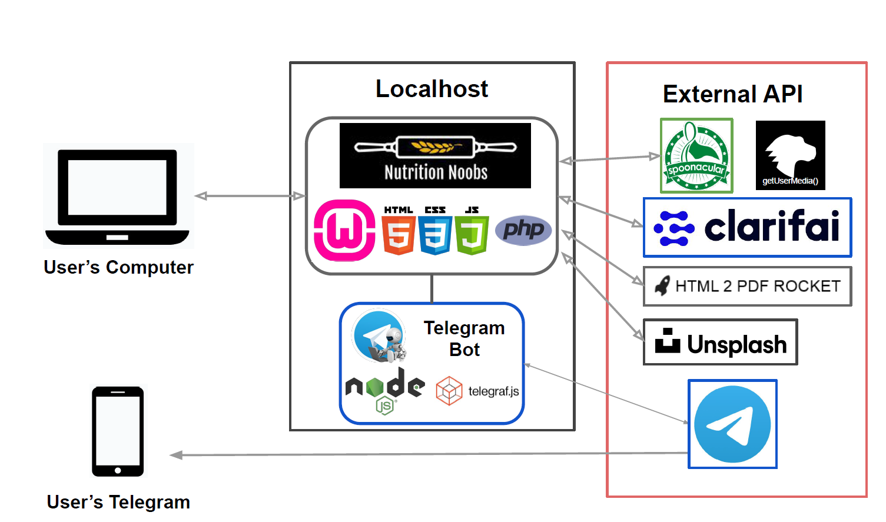

# Nutrition Noobs by {Nested Noobs}

This project aims to be an all-in-one website that helps users to reduce food wastage and also to eat healthy.

## Members

- Kenny Lee Wei Zhen
- Lin Meiling
- Tan Jun Hui
- Tay Joon Young
- Tan Rong Jian Mark

## Software Dependencies

- WAMPServer

## Folder Structure (Pages only)
```
|- TelegramBot
|- images
|- css
|- results
|  |- pdf
|  |- resources
|  |- recipeList.php
|  |- statistics.php
|- search
|  |- searchApi
|  |  |- SearchByIngredient.php
|  |  |- SearchByName.php
|  |  |- SearchByNutrition.php
|  |- ingredientForm.php
|  |- recipeNameForm.php
|  |- nutritionForm.php
|- README.md
|- main.php
|- search.php
```

## Architecture Diagram


## API Used

* [Spoonacular](https://spoonacular.com/food-api/docs) - Main API for searching recipes
* [Webcam.js](https://makitweb.com/how-to-capture-picture-from-webcam-with-webcam-js/) - Taking picture through webcam
* [Clarifai](https://rometools.github.io/rome/) - For image recognition
* [HTML 2 PDF Rocket](https://www.html2pdfrocket.com/#tour) - For converting HTML pages to PDF documents
* [Unsplash](https://unsplash.com/documentation) - For background images
* [Telegraf](https://github.com/telegraf/telegraf) - Wrapper for Telegram Bot API

## Telegram Bot
Telegram bot runs on a separate environment (Node.js), for instructions to set up [click here](./TelegramBot/readme.md)

## Notes
In case of valid search terms but no result is displayed, API key limit may be reached. Just change the API key to another one.